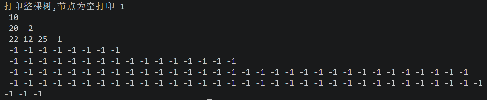
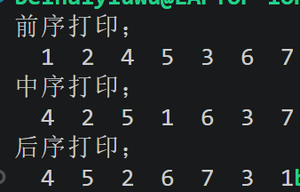
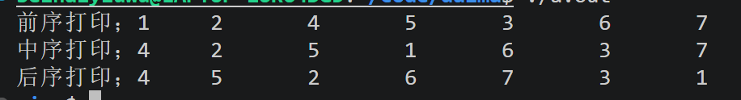

# step1 什么是树
1. 现在先了解什么是树，给树下一个定义。什么是二叉树？该如何定义一个二叉树？  
* 树是一种非线性的数据结构，由节点和连接节点的边组成。整体就像一个倒着的树，最上面的是根节点，根节点往下分产生子节点，每个子节点又可以往下分，最下面的节点为叶子节点。除了根节点外其它每个节点有且仅有一个父节点（显然不可能有两个父亲）。除此之外，树是不能成环的。各个节点之间靠指针或数组下标连接，串联起储存再不同位置的节点。
* 二叉树是特殊的树，每个节点最多有两个节点，叫作左右子节点。好像每一个树干都一分为二，所以叫二叉树。特殊的二叉树有空二叉树，满二叉树书，完全二叉树等。
* 二叉树（链式存储二叉树）的节点由结构体定义，包含存储的数据，指向左右子节点的指针。
```c
//结构体定义（链二叉树）
typedef struct nodetree{
    int data;//可以是整数，小数或字符
    struct nodetree *left;//指向左子树的指针
    struct nodetree *right;//指向右子树的指针 
}tree;
```
* 还有顺序存储二叉树，节点由数组的方式定义完成，依靠数组下标来实现数据访问，
2. 在这一题中我们只讨论二叉树。请你思考，二叉树在c语言中应该如何存储？二叉树有哪些特点？
* 二叉树在C语言中分为链式存储与顺序存储。链式存储就像链表一样，只不过是两个指针，因为要指向左右子树。手动开辟内存（malloc），存储位置不连续，通过指针连接。顺序存储是通过数组实现，把各个节点按照下标一次存储在数组中，访问直接靠下标，存储是连续的，大小也是固定的。
* 每个节点至多有两个子节点  
左右子节点不能互换，有序    
可以为空，但要说明，如空二叉树的存在。    
二叉树的每个子树也是二叉树，这便使得二叉树有递归性。  
有层次结构性，从根节点到叶子节点。  
3. 顺序存储二叉树
* 第一步实现初始化二叉树的，并设置大小节点设为空。每个节点的数据是按照顺序依次存储在数组中的，我便参考遍历数组的方式，使用for循环依次将数组中每个节点设置为空，将used标记为false，即为0，实现了0到99位置的节点设置为空。
* 创建根节点。为实现根节点的设置，我们创建了一个指向数组的指针，通过指针实现节点数组里值data的改变，并标记为true，完成了根节点的创建。
* 创建左右孩子与创建根节点类似，只不过多传了个数组下标。父节点（假设下标为i）对应的左孩子编号为2i，右孩子为2i+1,通过指针指向数组对应编号的节点，从而实现了data值的更改。只不过在真正赋值前要判断下标是否超出数组存储限度,是否正确初始化，所以加了些判断语句。
* 为实现层序遍历，需要对data值及是否为空进行判断。在这里使用布尔类型used进行了标记和判断，若为false，则为空，打印-1,反之打印存储的数。最难的应该是换行的实现，在这里我用了初始标记和末尾标记来实现分层打印。观察可得末尾下标是初始下标的2倍减1（树当中），如果i小于等于end并且不超过数组最大限度，则在该行重复打印。当i>end是循环结束，执行外圈循环。在该行的循环结束后将start值设为end+1，再将end设为start的2倍减1，并打印换行符，外面再套个循环（实现换行），如此便实现了换行。
* 调用函数要传地址，不能直接定义个指针就传（最开始我就这样，直接报错），因为没有初始话就是野指针，不知道指向哪里。准确来说是传个节点数组的地址，对应函数相应指针读取这个地址后再进行后面的操作。
* 补充；其实最开始我想过直接用数组，不用指针。但查阅资料，询问AI后这样做其实就相当与值传递，拷贝了个副本过去给相应函数，相应函数结束后所做的改变也消失了，所以要用指针，从根本上改变值和数。
* 打印图片；

# step2链二叉树
* 运行图片:


1. 聪明的你会发现，只使用简单的for循环无法实现这个打印函数。请你讲讲问什么无法实现。
* 这是链二叉树，数据的存储是不连续的，无法用类似于数组的下标一样的东西来刻画它存储的位置，只能通过指针访问地址，才能实现打印。区别于顺序存储，每个节点数据都连续存储在一个大盒子中，可以用连续自然数来依次访问，便可用for循环。还有一个重要原因是二叉树是分叉的，for循环可以进行单向刻画，但面对双向也就无能为力了。一个节点下方有两个节点，是往哪边走呢？for循环便解决不了了。
# step3递归
1. 请你思考上面递归的过程，讲讲为什么只改变printf函数出现的位置就可以实现这三种不同的递归。以前序遍历为例，讲讲二叉树中递归的过程。
* 程序是按顺序执行的，从上到下依次执行，不同顺序打印方式也就不同。以前序遍历为例，先打印根指针root指向data的值1，随后再次调用这个函数，只不过指针不在是root，而是root指向的left指针，接着再次运行这个函数，打印left指向的data值即2，随后再此运行该函数，指针为left指向的left，该指针打印完后，由于该节点为叶子节点，运行到下一级函数是为空直接返回到上一级，上一级函数再调用left指向的right指针，以此类推，使用完后再返回到上一级函数。第一级函数开始使用right指针，打印右子树，与左方一样。重复根左右这个过程，下一个左子树的父节点又称为根。
* 统计深度函数中为什么后面连个int不用指针变量？   
后面两个int数据只起到统计当前深度和总深度的作用，并不需要指针来改变值或指向其它地址。在这里使用了递归，每调用一次就在栈中创建保存一次相应的局部变量返回值等，相当于上一层函数的current_depth，max_depth的值拷贝了过去，并不起修改查找等作用，用完计算后直接返回一个值就是。递归到最底层后从下往上一次返回一个值，最后将这个值（深度大小）返回给主函数，相应的current_depth，max_depth的值也消失了。
* 递归与for循环；两者似乎很相似，但机制完全不同。for循环是一条线，重复循环执行一行代码。递归是套娃，函数里套函数，每层函数调用都会在栈中创建新的局部变量，与上层或下层函数的变量是完全不同的，每调用一次函数都会占用空间内存，for循环就不会，内存固定。相似的是两者都需要依靠判断来实现终止，不然for循环会一直循环直到死机，递归会发生栈溢出，内存耗尽终止。其次，for循环是单向一条线的，所以用来遍历数组链表是个不错的选择。递归可以分叉，便可以用来遍历像二叉树这样多分叉的数据结构，而且for循环占用内存少，速度快，相较而言嵌套栈占用内存多，速度要慢一些，只能说两者各有优缺，不能相互替代。
* 运行结果

* 感悟 一次递归的底层实现是依靠栈和循环来完成，入栈出栈，如果用相应栈的代码确实比较复杂，但对递归的本质有了更深层次的理解。除了栈的前序遍历，还有中序后序遍历，原理都差不多，先如栈的后出，后入栈的先出。所以要实现前序遍历（根左右），要先push右，再push左，这样先pop出来的才是右。
